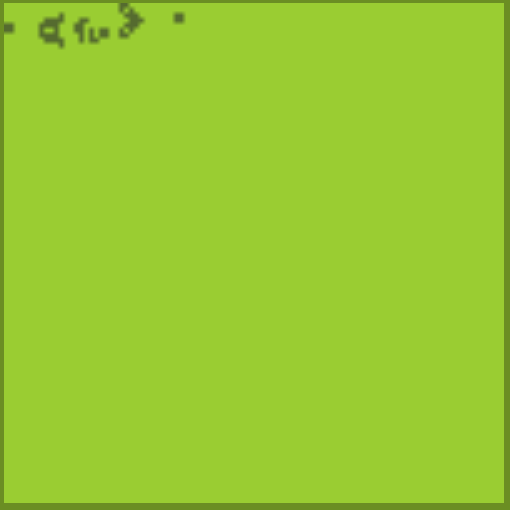
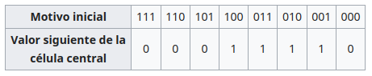

# __Autómata celular__

  

Un autómata celular (A.C.) es un __modelo matemático__ y __computacional__ para un __sistema dinámico__ que evoluciona en pasos __discretos__. Es adecuado para modelar sistemas naturales que puedan ser descritos como una colección masiva de objetos simples que __interactúen__ localmente unos con otros.

Son sistemas descubiertos dentro del campo de la __física computacional__ por __[John von Neumann](https://es.wikipedia.org/wiki/John_von_Neumann "John von Neumann")__ en la década de __1950__. La teoría de los autómatas celulares se inicia con su precursor John von Neumann a finales de la década de 1940 con su libro Theory of Self-reproducing Automata (editado y completado por A. W. Burks).

Aunque John von Neumann puso en práctica los AA.CC., estos fueron concebidos en los años 40 por __Konrad Zuse__ y __Stanislaw Ulam__. Zuse pensó en los “espacios de cómputo” (computing spaces), como modelos discretos de sistemas físicos. Las contribuciones de Ulam vinieron al final de los 40, poco después de haber inventado con __Nicholas Metropolis__ el __Método de Montecarlo__. 

## Descripción

No existe una definición formal y __matemática__ aceptada de autómata celular; sin embargo, se puede describir a un A.C. como una __tupla__, es decir, un conjunto ordenado de objetos caracterizado por los siguientes componentes: 

- Una *rejilla* o *cuadriculado* (__lattice__) de enteros (conjunto __*Z*__) infinitamente extendida, y con *dimensión* ***d ∈ Z+***. Cada celda de la cuadrícula se conoce como __célula__.

- Cada célula puede tomar un valor en ***Z*** a partir de un *conjunto finito de estados __k__*.

- Cada célula, además, se caracteriza por su __*vecindad*__, un conjunto finito de células en las cercanías de la misma.

- De acuerdo con esto, se aplica a todas las células de la cuadrícula una *función de transición* ( __*f*__ ) que toma como argumentos los valores de la célula en cuestión y los valores de sus vecinos, y regresa el nuevo valor que la célula tendrá en la siguiente etapa de tiempo. Esta función __*f*__ se aplica, como ya se dijo, de forma homogénea a todas las células, por cada paso discreto de tiempo.

## __Condiciones de frontera__

Por definición, un A.C. consiste en una retícula infinita de enteros. Sin embargo, para cuestiones prácticas (como en modelos de sistemas físicos llevados a cabo en ordenadores de memoria finita), se requiere tomar ciertas consideraciones a la hora de implementar un A.C. Por ello, la definición original se modifica para dar cabida a retículas finitas en las que las células del A.C. interactúen. Esto conlleva la consideración extra de lo que debe suceder con aquellas células que se encuentren en los __bordes__ de la retícula. A la implementación de una o varias consideraciones específicas se le conoce como __*condición de frontera*__.

Dentro del ámbito de los A.C., se pueden implementar numerosas condiciones de frontera, en función de lo que el problema real requiera para su modelado. Por ejemplo: 

- __Frontera abierta__: Se considera que fuera de la *lattice* residen células, todas con un valor fijo. En el caso particular del juego de la vida y de otros A.C. con dos estados en su conjunto __*k*__, una frontera se dice __*fría*__ si las células fuera de la frontera se consideran muertas, y __*caliente*__ si se consideran vivas.

- __Frontera periódica__: Se considera a la *lattice* como si sus extremos se tocaran. En una *lattice* de dimensión 1, esto puede visualizarse en dos dimensiones como una __circunferencia__. En dimensión 2, la lattice podría visualizarse en tres dimensiones como un __toroide__.

- __Frontera reflectora__: Se considera que las células fuera de la *lattice* "reflejan" los valores de aquellas dentro de la *lattice*. Así, una célula que estuviera junto al borde de la *lattice* (fuera de ella) tomaría como valor el de la célula que esté junto al borde de la *lattice*, dentro de ella.

- __Sin frontera__: Haciendo uso de implementaciones que hagan crecer dinámicamente el uso de memoria de la *lattice* implementada, se puede asumir que cada vez que las células deben interactuar con células fuera de la *lattice*, esta se hace más grande para dar cabida a estas interacciones. Obviamente, existe un límite (impuesto por la memoria disponible) para esta condición. Es muy importante no confundir esta condición de frontera con la definición original de A.C. cuya *lattice* es inicialmente infinita. En el caso de un A.C. sin frontera, la *lattice* comienza con un tamaño definido y finito, y conforme se requiera va creciendo en el tiempo, lo cual no lo hace necesariamente un modelo más cercano a la realidad, pues si se inicializara la *lattice* aleatoriamente, con esta condición sólo se pueden inicializar las células dentro de la *lattice* inicial finita, mientras que en el caso de la definición original, en teoría todas las células de la *lattice* infinita deberían ser inicializadas.

## __Variaciones__

Los A.C. pueden variar en alguna de las características antes mencionadas, derivando en autómatas celulares no *estándar*.

Por ejemplo, un A.C. estándar tiene una cuadrícula donde se asume que las células son cuadros; es decir, que la retícula tiene una geometría cuadrada. Esto no es necesariamente un requisito, y se puede variar el A.C. para presentar una geometría triangular o hexagonal (en A.C. de 2 dimensiones, el cuadrado, el triángulo y el hexágono son las únicas figuras geométricas que llenan el plano).

También puede variarse el conjunto de estados __*k*__ que cada célula puede tomar, la función de transición __*f*__ de forma que ya no sea homogénea, utilizar elementos estocásticos (aleatoriedad) en __*f*__ (lo que se conoce como A.C. *probabilístico*), variar las vecindades de cada célula, etc. 

## Historia

La historia de los autómatas celulares puede ser clasificada en tres etapas asociadas a los nombres de los científicos que en cada momento marcaron un punto de inflexión en el desarrollo de la teoría: la era de Von Neumann, la era de John Horton Conway y la era de Stephen Wolfram. 

## __Era de Von Neumann__

La primera etapa la inicia von Neumann,​ quien una vez terminada su participación en el desarrollo y terminación de la primera computadora __ENIAC__ tenía en mente desarrollar una máquina con la capacidad de construir a partir de sí misma otras máquinas (auto-reproducción) y soportar comportamiento complejo. Con la ayuda de su amigo __Stanislaw Ulam__, von Neumann implementa la teoría de los autómatas celulares en un vector de dos dimensiones __*Z*__ × __*Z*__ (donde __*Z*__ representa el conjunto de los enteros). El vector es llamado el espacio de evoluciones y cada una de las posiciones (llamadas *células*) en el vector toma un valor del conjunto de estados |__*k*__| = __*29*__. La *función de transición* que determina el comportamiento del autómata celular utiliza la __vecindad de von Neumann__, que consiste en un elemento central *x* ( *i* , *j* ) (llamada *célula central*) y sus *vecinos* que son las células __*x* ( *i* , *j* − *1* ), *x* ( *i* , *j* + *1* ), *x* ( *i* − *1* , *j* )__ y __*x* ( *i* *+* *1* , *j* )__ (es decir, la célula en cuestión y sus células vecinas más próximas, arriba, abajo, izquierda y derecha, respectivamente).

## __Era de John Horton Conway__

En __1970, John Horton Conway__ dio a conocer el autómata celular que probablemente sea el más conocido: __el Juego de la vida__ (*Life*), publicado por __Martin Gardner__ en su columna *Mathematical Games* en la revista __Scientific American__.​ *Life* ocupa una cuadrícula (lattice bidimensional) donde se coloca al inicio un patrón de células "vivas" o "muertas". La vecindad para cada célula son ocho: los vecinos formados por la vecindad de Von Neumann y las cuatro células de las dos diagonales (esta vecindad se conoce como __vecindad de Moore__). De manera repetida, se aplican simultáneamente sobre todas las células de la cuadrícula las siguientes 3 reglas:

    1. *Nacimiento*: se reemplaza una célula muerta por una viva si dicha célula tiene exactamente 3 vecinos vivos.

    2. *Muerte*: se reemplaza una célula viva por una muerta si dicha célula no tiene más de 1 vecino vivo (muerte por aislamiento) o si tiene más de 3 vecinos vivos (muerte por sobrepoblación).

    3. *Supervivencia*: una célula viva permanecerá en ese estado si tiene 2 o 3 vecinos vivos.

Una de las características más importantes de *Life* es su capacidad de realizar __cómputo universal__, es decir, que con una distribución inicial apropiada de células vivas y muertas, *Life* se puede convertir en una computadora de propósito general (__máquina de Turing__). 

## __Era de Stephen Wolfram__

__Stephen Wolfram__ ​ha realizado numerosas investigaciones sobre el comportamiento cualitativo de los A.C. Con base en su trabajo sobre AC unidimensionales, con dos o tres estados, sobre configuraciones periódicas que se presentan en el A.C., observó sus evoluciones para configuraciones iniciales aleatorias. Así, dada una regla, el A.C. exhibe diferentes comportamientos para diferentes condiciones iniciales.

De esta manera, Wolfram clasificó el comportamiento cualitativo de los A.C. unidimensionales. De acuerdo con esto, un AC pertenece a una de las siguientes clases: 

* __Clase I__. La evolución lleva a una configuración estable y homogénea, es decir, todas las células terminan por llegar al mismo valor.

* __Clase II__. La evolución lleva a un conjunto de estructuras simples que son estables o periódicas.

* __Clase III__. La evolución lleva a un patrón __caótico__.

* __Clase IV__. La evolución lleva a estructuras aisladas que muestran un comportamiento __complejo__ (es decir, ni completamente caótico, ni completamente ordenado, sino en la línea entre uno y otro, este suele ser el tipo de comportamiento más interesante que un __sistema dinámico__ puede presentar).

## Aplicaciones

Los autómatas celulares pueden ser usados para modelar numerosos sistemas físicos que se caractericen por un gran número de componentes homogéneos y que interactúen localmente entre sí. De hecho, cualquier sistema real al que se le puedan analogar los conceptos de "vecindad", "estados de los componentes" y "función de transición" es candidato para ser modelado por un A.C.

Las características de los autómatas celulares harán que dichos modelos sean discretos en tiempo, espacio o ambos, dependiendo de la variante de la definición de A.C. que se use. Algunos ejemplos de áreas en donde se utilizan los autómatas celulares son: 

* Modelado del flujo de __tráfico__ y de peatones.
* Modelado de fluidos (__gases__ o __líquidos__).
* Modelado de la evolución de células o virus como el __VIH__.
* Modelado de procesos de __percolación__.

## Ejemplos de autómatas celulares

## __AC de una dimensión__

El AC no trivial más simple consiste en una retícula unidimensional de células que sólo pueden tener dos estados (« 0 » o « 1 »), con un vecindario constituido, para cada célula, por ella misma y por las dos células adyacentes (2 __3__ =8 configuraciones posibles). Existen 2 __8__=256 modos de definir cuál ha de ser el estado de una célula en la generación siguiente para cada una de estas configuraciones, luego existen 256 AC diferentes de este tipo.

Consideremos el AC definido por la tabla siguiente, que nos da la regla de evolución: 

  

## Referencias

     1. von Neumann, J. (1966)The Theory of Self-reproducing Automata, ed. Univ. of Illinois Press, Urbana, IL
     2. Gardner, M. (1970) Mathematical Games: The fantastic combinations of John Conway's new solitaire game "Life", Scientific American
     3. Wolfram (1986), Theory and Application of Cellular Automata, World Scientific, Singapur

